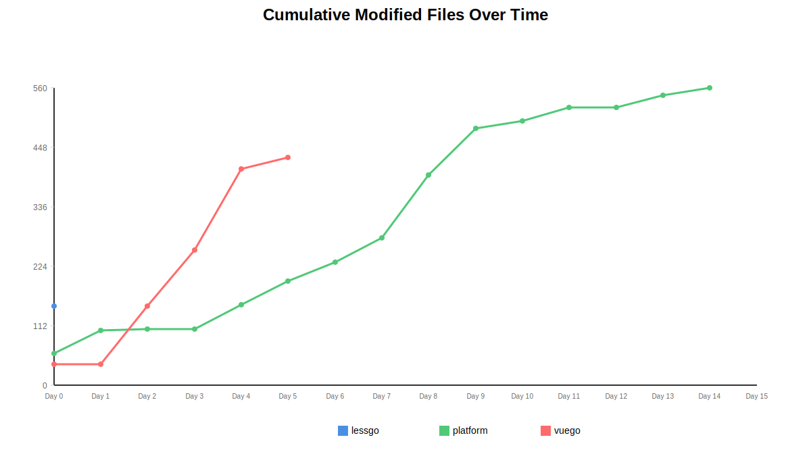
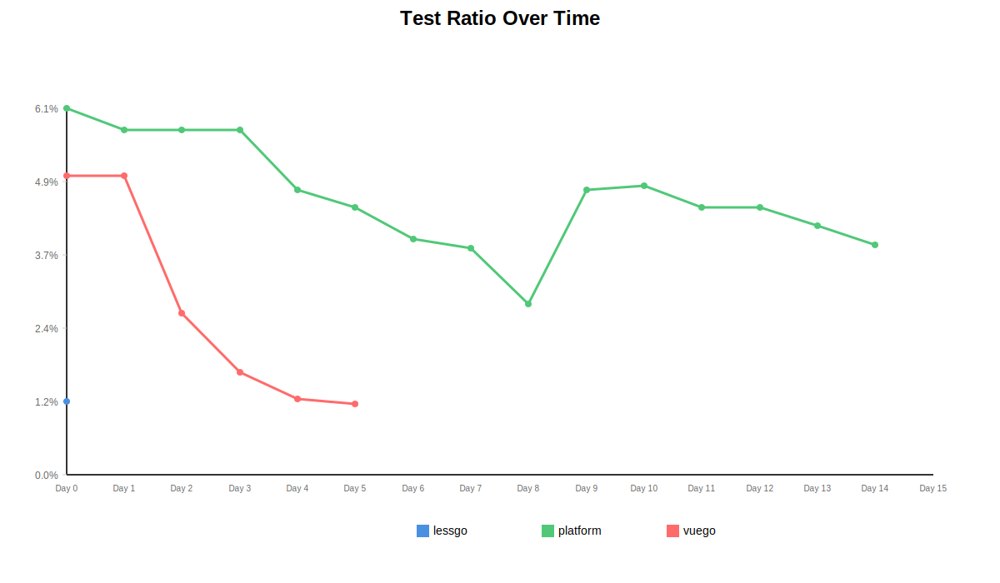

# Cross-Repository Analysis Report

This report compares statistics across all repositories over time.

## Visualizations

### Cumulative Files Over Time

[View full chart](chart-cumulative-files-v2.svg)

### Cumulative Lines Over Time

[View full chart](chart-cumulative-lines-v2.svg)

### Cumulative Modified Files Over Time

[View full chart](chart-modified-files-v2.svg)

### Code Churn Over Time

[View full chart](chart-code-churn-v2.svg)

### Test Ratio Over Time

[View full chart](chart-test-ratio-v2.svg)

## Overall Comparison

| Repository | Total Active Days | Total Commits | Total Files Added | Total Files Removed | Total Lines Added | Total Lines Removed | Net Files | Net Lines | Code Churn | Test Ratio |
|------------|-------------------|---------------|------------------|---------------------|-------------------|---------------------|-----------|----------|------------|------------|
| lessgo | 1 | 50 | 170 | 7 | 5977 | 2074 | 163 | 3903 | 25.8% | 1.2% |
| platform | 13 | 106 | 144 | 66 | 8750 | 4658 | 78 | 4092 | 34.7% | 3.8% |
| vuego | 5 | 61 | 174 | 6 | 22810 | 4011 | 168 | 18799 | 15.0% | 1.2% |

## Daily Comparison Across Repositories

### Commits Over Time

| Date | lessgo | platform | vuego | 
|------|------|------|------|
| 2025-10-25 | 0 | 10 | 0 | 
| 2025-10-26 | 0 | 12 | 0 | 
| 2025-10-27 | 0 | 2 | 0 | 
| 2025-10-29 | 0 | 7 | 0 | 
| 2025-10-30 | 0 | 6 | 0 | 
| 2025-10-31 | 0 | 4 | 0 | 
| 2025-11-01 | 0 | 10 | 0 | 
| 2025-11-02 | 0 | 32 | 0 | 
| 2025-11-03 | 0 | 2 | 0 | 
| 2025-11-04 | 0 | 6 | 0 | 
| 2025-11-05 | 0 | 6 | 0 | 
| 2025-11-07 | 0 | 5 | 0 | 
| 2025-11-08 | 0 | 4 | 0 | 
| 2025-11-11 | 0 | 0 | 1 | 
| 2025-11-13 | 0 | 0 | 9 | 
| 2025-11-14 | 0 | 0 | 13 | 
| 2025-11-15 | 0 | 0 | 33 | 
| 2025-11-16 | 0 | 0 | 5 | 
| 2025-11-17 | 50 | 0 | 0 | 

### Files Added Over Time

| Date | lessgo | platform | vuego | 
|------|------|------|------|
| 2025-10-25 | 0 | 49 | 0 | 
| 2025-10-26 | 0 | 4 | 0 | 
| 2025-10-27 | 0 | 0 | 0 | 
| 2025-10-29 | 0 | 11 | 0 | 
| 2025-10-30 | 0 | 10 | 0 | 
| 2025-10-31 | 0 | 14 | 0 | 
| 2025-11-01 | 0 | 3 | 0 | 
| 2025-11-02 | 0 | 26 | 0 | 
| 2025-11-03 | 0 | 9 | 0 | 
| 2025-11-04 | 0 | 1 | 0 | 
| 2025-11-05 | 0 | 6 | 0 | 
| 2025-11-07 | 0 | 5 | 0 | 
| 2025-11-08 | 0 | 6 | 0 | 
| 2025-11-11 | 0 | 0 | 40 | 
| 2025-11-13 | 0 | 0 | 39 | 
| 2025-11-14 | 0 | 0 | 42 | 
| 2025-11-15 | 0 | 0 | 42 | 
| 2025-11-16 | 0 | 0 | 11 | 
| 2025-11-17 | 170 | 0 | 0 | 

### Files Removed Over Time

| Date | lessgo | platform | vuego | 
|------|------|------|------|
| 2025-10-25 | 0 | 0 | 0 | 
| 2025-10-26 | 0 | 1 | 0 | 
| 2025-10-27 | 0 | 0 | 0 | 
| 2025-10-29 | 0 | 0 | 0 | 
| 2025-10-30 | 0 | 6 | 0 | 
| 2025-10-31 | 0 | 5 | 0 | 
| 2025-11-01 | 0 | 0 | 0 | 
| 2025-11-02 | 0 | 0 | 0 | 
| 2025-11-03 | 0 | 51 | 0 | 
| 2025-11-04 | 0 | 2 | 0 | 
| 2025-11-05 | 0 | 1 | 0 | 
| 2025-11-07 | 0 | 0 | 0 | 
| 2025-11-08 | 0 | 0 | 0 | 
| 2025-11-11 | 0 | 0 | 0 | 
| 2025-11-13 | 0 | 0 | 5 | 
| 2025-11-14 | 0 | 0 | 0 | 
| 2025-11-15 | 0 | 0 | 1 | 
| 2025-11-16 | 0 | 0 | 0 | 
| 2025-11-17 | 7 | 0 | 0 | 

### Lines Added Over Time

| Date | lessgo | platform | vuego | 
|------|------|------|------|
| 2025-10-25 | 0 | 2154 | 0 | 
| 2025-10-26 | 0 | 351 | 0 | 
| 2025-10-27 | 0 | 10 | 0 | 
| 2025-10-29 | 0 | 634 | 0 | 
| 2025-10-30 | 0 | 718 | 0 | 
| 2025-10-31 | 0 | 751 | 0 | 
| 2025-11-01 | 0 | 468 | 0 | 
| 2025-11-02 | 0 | 1731 | 0 | 
| 2025-11-03 | 0 | 408 | 0 | 
| 2025-11-04 | 0 | 55 | 0 | 
| 2025-11-05 | 0 | 465 | 0 | 
| 2025-11-07 | 0 | 127 | 0 | 
| 2025-11-08 | 0 | 878 | 0 | 
| 2025-11-11 | 0 | 0 | 1453 | 
| 2025-11-13 | 0 | 0 | 4223 | 
| 2025-11-14 | 0 | 0 | 8451 | 
| 2025-11-15 | 0 | 0 | 8080 | 
| 2025-11-16 | 0 | 0 | 603 | 
| 2025-11-17 | 5977 | 0 | 0 | 

### Lines Removed Over Time

| Date | lessgo | platform | vuego | 
|------|------|------|------|
| 2025-10-25 | 0 | 51 | 0 | 
| 2025-10-26 | 0 | 158 | 0 | 
| 2025-10-27 | 0 | 8 | 0 | 
| 2025-10-29 | 0 | 219 | 0 | 
| 2025-10-30 | 0 | 407 | 0 | 
| 2025-10-31 | 0 | 317 | 0 | 
| 2025-11-01 | 0 | 215 | 0 | 
| 2025-11-02 | 0 | 886 | 0 | 
| 2025-11-03 | 0 | 2042 | 0 | 
| 2025-11-04 | 0 | 87 | 0 | 
| 2025-11-05 | 0 | 179 | 0 | 
| 2025-11-07 | 0 | 46 | 0 | 
| 2025-11-08 | 0 | 43 | 0 | 
| 2025-11-11 | 0 | 0 | 0 | 
| 2025-11-13 | 0 | 0 | 1279 | 
| 2025-11-14 | 0 | 0 | 770 | 
| 2025-11-15 | 0 | 0 | 1941 | 
| 2025-11-16 | 0 | 0 | 21 | 
| 2025-11-17 | 2074 | 0 | 0 | 

## Cumulative Statistics Over Time

### Cumulative Files (Added - Removed)

| Date | lessgo | platform | vuego | 
|------|------|------|------|
| 2025-10-25 | 0 | 49 | 0 | 
| 2025-10-26 | 0 | 52 | 0 | 
| 2025-10-27 | 0 | 52 | 0 | 
| 2025-10-29 | 0 | 63 | 0 | 
| 2025-10-30 | 0 | 67 | 0 | 
| 2025-10-31 | 0 | 76 | 0 | 
| 2025-11-01 | 0 | 79 | 0 | 
| 2025-11-02 | 0 | 105 | 0 | 
| 2025-11-03 | 0 | 63 | 0 | 
| 2025-11-04 | 0 | 62 | 0 | 
| 2025-11-05 | 0 | 67 | 0 | 
| 2025-11-07 | 0 | 72 | 0 | 
| 2025-11-08 | 0 | 78 | 0 | 
| 2025-11-11 | 0 | 78 | 40 | 
| 2025-11-13 | 0 | 78 | 74 | 
| 2025-11-14 | 0 | 78 | 116 | 
| 2025-11-15 | 0 | 78 | 157 | 
| 2025-11-16 | 0 | 78 | 168 | 
| 2025-11-17 | 163 | 78 | 168 | 

### Cumulative Lines (Added - Removed)

| Date | lessgo | platform | vuego | 
|------|------|------|------|
| 2025-10-25 | 0 | 2103 | 0 | 
| 2025-10-26 | 0 | 2296 | 0 | 
| 2025-10-27 | 0 | 2298 | 0 | 
| 2025-10-29 | 0 | 2713 | 0 | 
| 2025-10-30 | 0 | 3024 | 0 | 
| 2025-10-31 | 0 | 3458 | 0 | 
| 2025-11-01 | 0 | 3711 | 0 | 
| 2025-11-02 | 0 | 4556 | 0 | 
| 2025-11-03 | 0 | 2922 | 0 | 
| 2025-11-04 | 0 | 2890 | 0 | 
| 2025-11-05 | 0 | 3176 | 0 | 
| 2025-11-07 | 0 | 3257 | 0 | 
| 2025-11-08 | 0 | 4092 | 0 | 
| 2025-11-11 | 0 | 4092 | 1453 | 
| 2025-11-13 | 0 | 4092 | 4397 | 
| 2025-11-14 | 0 | 4092 | 12078 | 
| 2025-11-15 | 0 | 4092 | 18217 | 
| 2025-11-16 | 0 | 4092 | 18799 | 
| 2025-11-17 | 3903 | 4092 | 18799 | 

### Test Ratio Over Time

| Date | lessgo | platform | vuego | 
|------|------|------|------|
| 2025-10-25 | - | 6.1% | - | 
| 2025-10-26 | - | 5.8% | - | 
| 2025-10-27 | - | 5.8% | - | 
| 2025-10-29 | - | 4.8% | - | 
| 2025-10-30 | - | 4.5% | - | 
| 2025-10-31 | - | 3.9% | - | 
| 2025-11-01 | - | 3.8% | - | 
| 2025-11-02 | - | 2.9% | - | 
| 2025-11-03 | - | 4.8% | - | 
| 2025-11-04 | - | 4.8% | - | 
| 2025-11-05 | - | 4.5% | - | 
| 2025-11-07 | - | 4.2% | - | 
| 2025-11-08 | - | 3.8% | - | 
| 2025-11-11 | - | - | 5.0% | 
| 2025-11-13 | - | - | 2.7% | 
| 2025-11-14 | - | - | 1.7% | 
| 2025-11-15 | - | - | 1.3% | 
| 2025-11-16 | - | - | 1.2% | 
| 2025-11-17 | 1.2% | - | - | 

