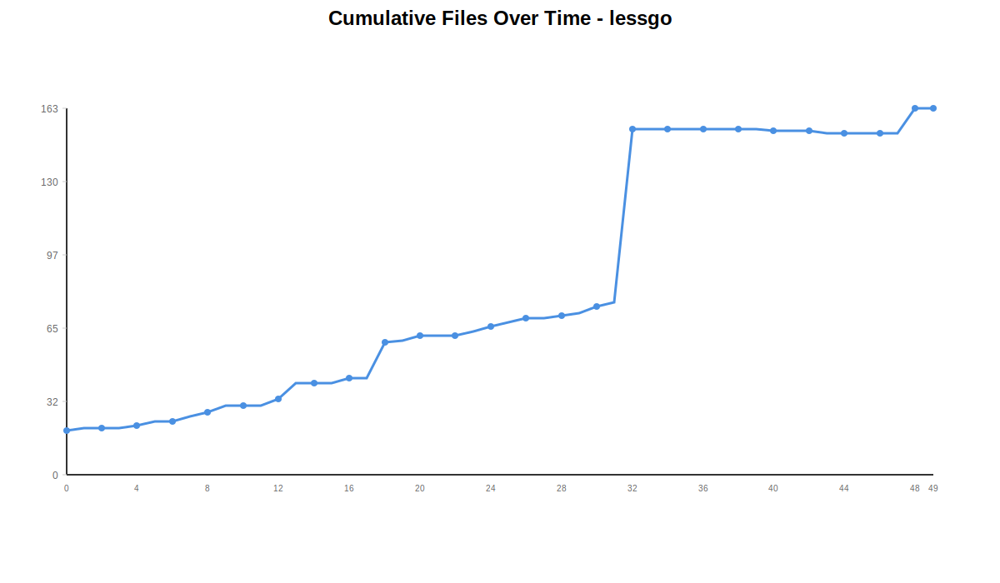
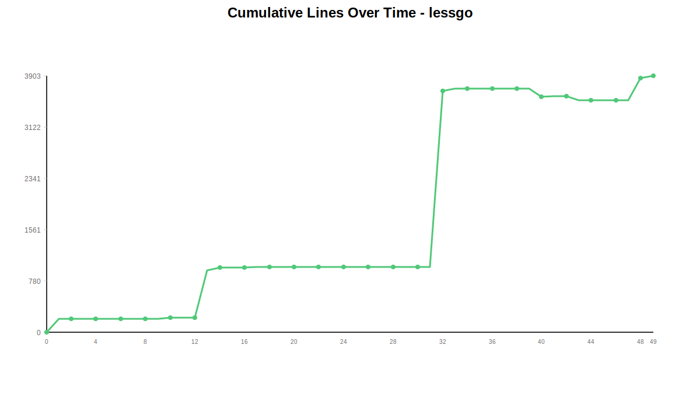
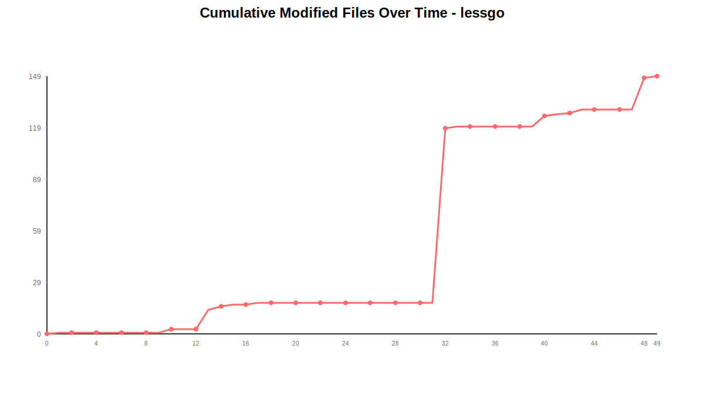
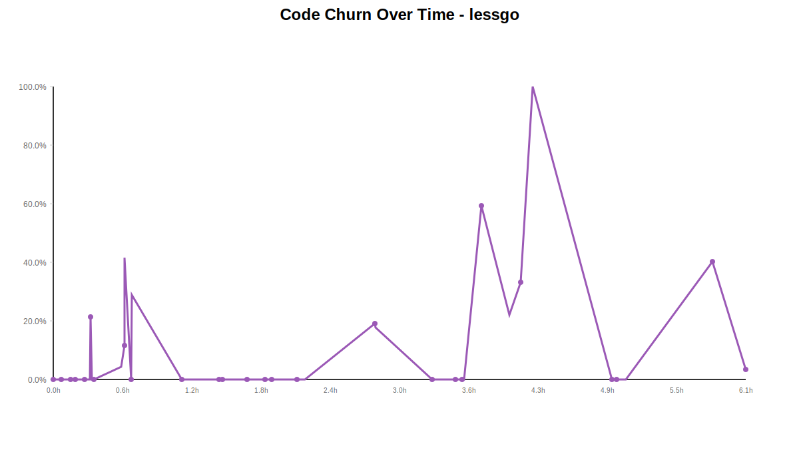
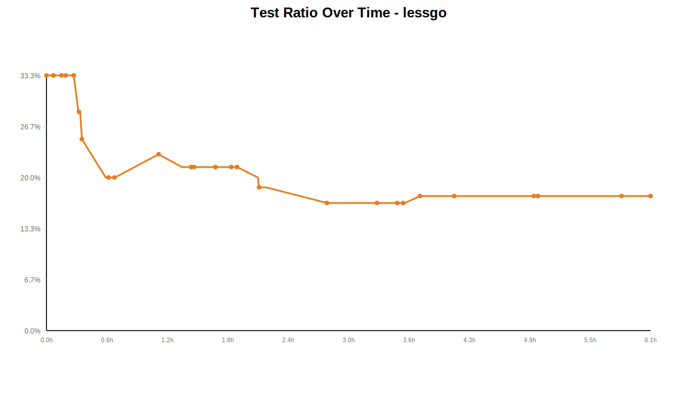

# Git Repository Analysis: lessgo

This document contains statistics and analysis for the **lessgo** repository.

## Overall Statistics

**Total Commits:** 50

## Visualizations

### Cumulative Files Over Time

[View full chart](chart-cumulative-files.svg)

### Cumulative Lines Over Time

[View full chart](chart-cumulative-lines.svg)

### Cumulative Modified Files Over Time

[View full chart](chart-modified-files.svg)

### Code Churn Over Time

[View full chart](chart-code-churn.svg)

### Test Ratio Over Time

[View full chart](chart-test-ratio.svg)

## Hourly Activity (24-Hour Histogram)

| Hour | Commits | Bar |
|------|---------|-----|
| 00:00 | 0 |  |
| 01:00 | 0 |  |
| 02:00 | 0 |  |
| 03:00 | 0 |  |
| 04:00 | 0 |  |
| 05:00 | 0 |  |
| 06:00 | 0 |  |
| 07:00 | 0 |  |
| 08:00 | 0 |  |
| 09:00 | 14 | ██████████████████████████████████████████████████ |
| 10:00 | 9 | ████████████████████████████████ |
| 11:00 | 9 | ████████████████████████████████ |
| 12:00 | 8 | ████████████████████████████ |
| 13:00 | 4 | ██████████████ |
| 14:00 | 4 | ██████████████ |
| 15:00 | 2 | ███████ |
| 16:00 | 0 |  |
| 17:00 | 0 |  |
| 18:00 | 0 |  |
| 19:00 | 0 |  |
| 20:00 | 0 |  |
| 21:00 | 0 |  |
| 22:00 | 0 |  |
| 23:00 | 0 |  |

## Daily Statistics

| Date | Commits | Files Added | Files Removed | Lines Added | Lines Removed |
|------|---------|-------------|---------------|-------------|---------------|
| 2025-11-17 | 50 | 170 | 7 | 5977 | 2074 |

## Test Ratio Over Time

| Date | Test Files | Source Files | Total Go Files | Test Ratio |
|------|------------|--------------|----------------|------------|
| 2025-11-17 | 3 | 14 | 17 | 17.6% |

## Commit-by-Commit Analysis

This section provides detailed metrics for each commit.

| Commit | Date | Time | Files Added | Files Removed | Files Changed | Lines Added | Lines Removed | Total Files | Test Files | Source Files | Test Ratio | Code Churn |
|--------|------|------|-------------|---------------|---------------|-------------|---------------|-------------|------------|--------------|------------|------------|
| 89e8268d | 2025-11-17 | 09:23:06 | 20 | 0 | 0 | 0 | 0 | 20 | 2 | 4 | 33.3% | 0.0% |
| 42250126 | 2025-11-17 | 09:23:29 | 1 | 0 | 1 | 210 | 0 | 21 | 2 | 4 | 33.3% | 0.0% |
| 3fbf881e | 2025-11-17 | 09:27:19 | 0 | 0 | 0 | 0 | 0 | 21 | 2 | 4 | 33.3% | 0.0% |
| c95564c5 | 2025-11-17 | 09:28:03 | 0 | 0 | 0 | 0 | 0 | 21 | 2 | 4 | 33.3% | 0.0% |
| 42632ebe | 2025-11-17 | 09:32:17 | 1 | 0 | 0 | 0 | 0 | 22 | 2 | 4 | 33.3% | 0.0% |
| e74f630a | 2025-11-17 | 09:33:03 | 2 | 0 | 0 | 0 | 0 | 24 | 2 | 4 | 33.3% | 0.0% |
| ac05e9a0 | 2025-11-17 | 09:34:59 | 0 | 0 | 0 | 0 | 0 | 24 | 2 | 4 | 33.3% | 0.0% |
| 7210109f | 2025-11-17 | 09:35:20 | 2 | 0 | 0 | 0 | 0 | 26 | 2 | 4 | 33.3% | 0.0% |
| 183a5bd8 | 2025-11-17 | 09:39:48 | 2 | 0 | 0 | 0 | 0 | 28 | 2 | 4 | 33.3% | 0.0% |
| cf0bff10 | 2025-11-17 | 09:42:31 | 3 | 0 | 0 | 0 | 0 | 31 | 2 | 5 | 28.6% | 0.0% |
| fd1f4a9b | 2025-11-17 | 09:42:56 | 0 | 0 | 2 | 22 | 6 | 31 | 2 | 5 | 28.6% | 21.4% |
| 77c2571d | 2025-11-17 | 09:43:37 | 0 | 0 | 0 | 0 | 0 | 31 | 2 | 5 | 28.6% | 0.0% |
| 36a41504 | 2025-11-17 | 09:44:38 | 3 | 0 | 0 | 0 | 0 | 34 | 2 | 6 | 25.0% | 0.0% |
| 574648f0 | 2025-11-17 | 09:59:06 | 7 | 0 | 11 | 755 | 35 | 41 | 2 | 8 | 20.0% | 4.4% |
| 8e62822d | 2025-11-17 | 10:00:39 | 0 | 0 | 2 | 45 | 6 | 41 | 2 | 8 | 20.0% | 11.8% |
| deafb8f9 | 2025-11-17 | 10:00:48 | 0 | 0 | 1 | 7 | 5 | 41 | 2 | 8 | 20.0% | 41.7% |
| 43bb5e35 | 2025-11-17 | 10:04:16 | 2 | 0 | 0 | 0 | 0 | 43 | 2 | 8 | 20.0% | 0.0% |
| 02f48ec7 | 2025-11-17 | 10:04:37 | 0 | 0 | 1 | 22 | 9 | 43 | 2 | 8 | 20.0% | 29.0% |
| c06eb4c3 | 2025-11-17 | 10:31:09 | 16 | 0 | 0 | 0 | 0 | 59 | 3 | 10 | 23.1% | 0.0% |
| cc5f193e | 2025-11-17 | 10:45:00 | 1 | 0 | 0 | 0 | 0 | 60 | 3 | 11 | 21.4% | 0.0% |
| 2fad6239 | 2025-11-17 | 10:50:44 | 2 | 0 | 0 | 0 | 0 | 62 | 3 | 11 | 21.4% | 0.0% |
| c7593bfe | 2025-11-17 | 10:51:18 | 0 | 0 | 0 | 0 | 0 | 62 | 3 | 11 | 21.4% | 0.0% |
| 1758e838 | 2025-11-17 | 10:52:30 | 0 | 0 | 0 | 0 | 0 | 62 | 3 | 11 | 21.4% | 0.0% |
| 0daa71b6 | 2025-11-17 | 11:04:37 | 2 | 0 | 0 | 0 | 0 | 64 | 3 | 11 | 21.4% | 0.0% |
| 94bb6785 | 2025-11-17 | 11:05:14 | 2 | 0 | 0 | 0 | 0 | 66 | 3 | 11 | 21.4% | 0.0% |
| cb90c527 | 2025-11-17 | 11:13:39 | 2 | 0 | 0 | 0 | 0 | 68 | 3 | 11 | 21.4% | 0.0% |
| c2e6f3e9 | 2025-11-17 | 11:14:46 | 2 | 0 | 0 | 0 | 0 | 70 | 3 | 11 | 21.4% | 0.0% |
| 2cd34257 | 2025-11-17 | 11:15:03 | 0 | 0 | 0 | 0 | 0 | 70 | 3 | 11 | 21.4% | 0.0% |
| e402183c | 2025-11-17 | 11:18:15 | 1 | 0 | 0 | 0 | 0 | 71 | 3 | 11 | 21.4% | 0.0% |
| fbd4a3f8 | 2025-11-17 | 11:31:10 | 1 | 0 | 0 | 0 | 0 | 72 | 3 | 12 | 20.0% | 0.0% |
| a82bb6db | 2025-11-17 | 11:31:37 | 3 | 0 | 0 | 0 | 0 | 75 | 3 | 13 | 18.8% | 0.0% |
| 52624863 | 2025-11-17 | 11:36:03 | 2 | 0 | 0 | 0 | 0 | 77 | 3 | 13 | 18.8% | 0.0% |
| 37c0e956 | 2025-11-17 | 12:12:39 | 82 | 5 | 101 | 3507 | 834 | 154 | 3 | 15 | 16.7% | 19.2% |
| e9bb3edd | 2025-11-17 | 12:12:57 | 0 | 0 | 1 | 55 | 12 | 154 | 3 | 15 | 16.7% | 17.9% |
| 6ad402ec | 2025-11-17 | 12:42:48 | 0 | 0 | 0 | 0 | 0 | 154 | 3 | 15 | 16.7% | 0.0% |
| 5d4188fa | 2025-11-17 | 12:54:08 | 0 | 0 | 0 | 0 | 0 | 154 | 3 | 15 | 16.7% | 0.0% |
| 038a8527 | 2025-11-17 | 12:55:11 | 0 | 0 | 0 | 0 | 0 | 154 | 3 | 15 | 16.7% | 0.0% |
| 70d472ae | 2025-11-17 | 12:55:44 | 0 | 0 | 0 | 0 | 0 | 154 | 3 | 15 | 16.7% | 0.0% |
| bf1bb1b1 | 2025-11-17 | 12:58:51 | 0 | 0 | 0 | 0 | 0 | 154 | 3 | 15 | 16.7% | 0.0% |
| 1c861eb6 | 2025-11-17 | 12:59:42 | 0 | 0 | 0 | 0 | 0 | 154 | 3 | 15 | 16.7% | 0.0% |
| f1464257 | 2025-11-17 | 13:08:54 | 0 | 1 | 6 | 275 | 401 | 153 | 3 | 14 | 17.6% | 59.3% |
| 6387df7b | 2025-11-17 | 13:23:38 | 0 | 0 | 1 | 14 | 4 | 153 | 3 | 14 | 17.6% | 22.2% |
| 597c1861 | 2025-11-17 | 13:29:42 | 0 | 0 | 1 | 2 | 1 | 153 | 3 | 14 | 17.6% | 33.3% |
| d0c44d99 | 2025-11-17 | 13:35:53 | 0 | 1 | 2 | 0 | 63 | 152 | 3 | 14 | 17.6% | 100.0% |
| 066310d1 | 2025-11-17 | 14:17:40 | 0 | 0 | 0 | 0 | 0 | 152 | 3 | 14 | 17.6% | 0.0% |
| 189f291b | 2025-11-17 | 14:18:42 | 0 | 0 | 0 | 0 | 0 | 152 | 3 | 14 | 17.6% | 0.0% |
| 8f6143a3 | 2025-11-17 | 14:20:19 | 0 | 0 | 0 | 0 | 0 | 152 | 3 | 14 | 17.6% | 0.0% |
| b809ec06 | 2025-11-17 | 14:24:59 | 0 | 0 | 0 | 0 | 0 | 152 | 3 | 14 | 17.6% | 0.0% |
| e6cf52f3 | 2025-11-17 | 15:10:43 | 11 | 0 | 18 | 1035 | 697 | 163 | 3 | 14 | 17.6% | 40.2% |
| ee0008d6 | 2025-11-17 | 15:28:03 | 0 | 0 | 1 | 28 | 1 | 163 | 3 | 14 | 17.6% | 3.4% |

