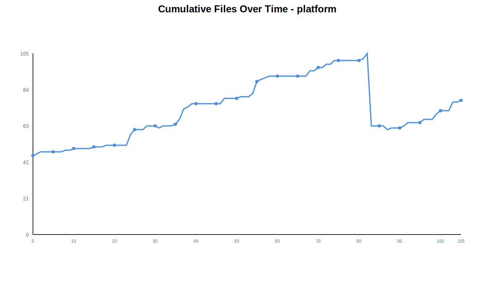
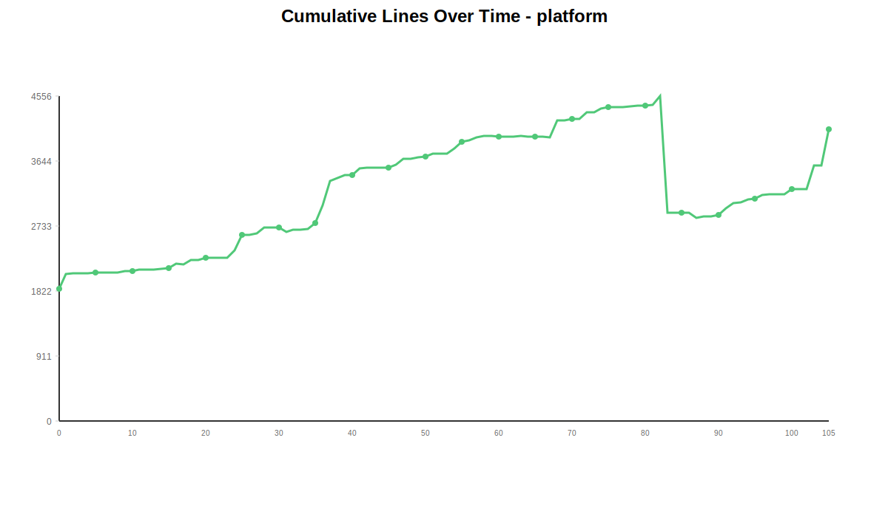
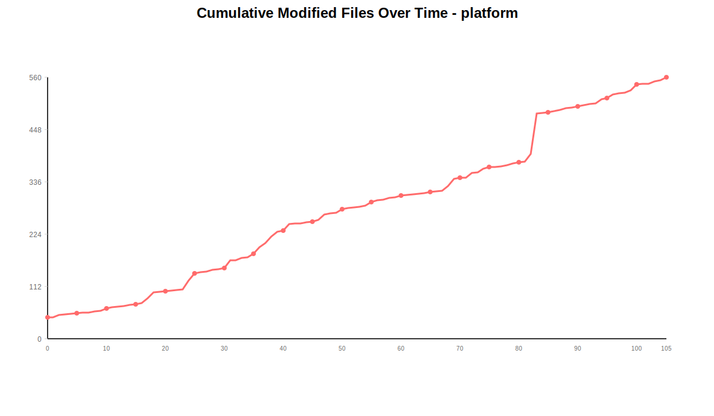
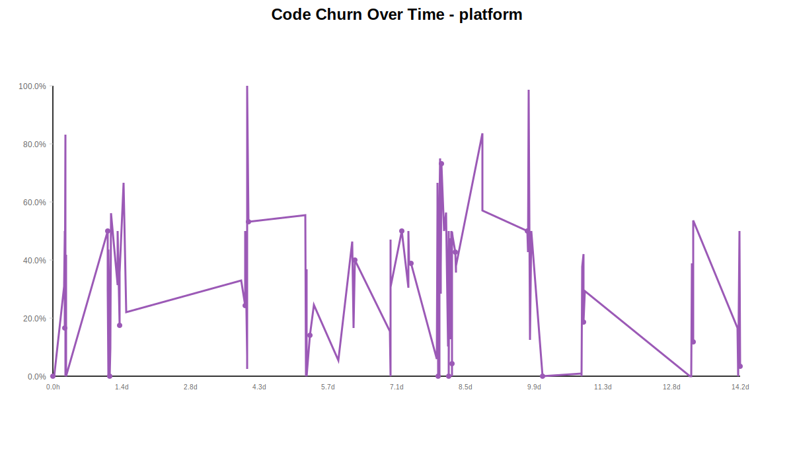
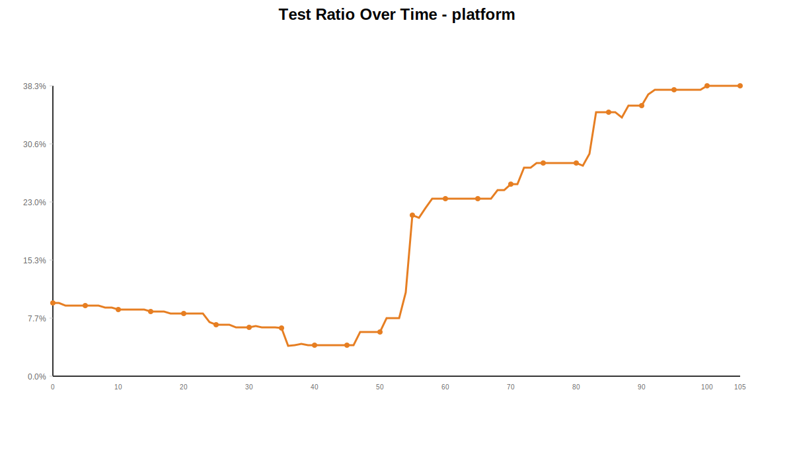

# Git Repository Analysis: platform

This document contains statistics and analysis for the **platform** repository.

## Overall Statistics

**Total Commits:** 106

## Visualizations

### Cumulative Files Over Time

[View full chart](chart-cumulative-files.svg)

### Cumulative Lines Over Time

[View full chart](chart-cumulative-lines.svg)

### Cumulative Modified Files Over Time

[View full chart](chart-modified-files.svg)

### Code Churn Over Time

[View full chart](chart-code-churn.svg)

### Test Ratio Over Time

[View full chart](chart-test-ratio.svg)

## Hourly Activity (24-Hour Histogram)

| Hour | Commits | Bar |
|------|---------|-----|
| 00:00 | 0 |  |
| 01:00 | 1 | ███ |
| 02:00 | 1 | ███ |
| 03:00 | 0 |  |
| 04:00 | 0 |  |
| 05:00 | 0 |  |
| 06:00 | 0 |  |
| 07:00 | 0 |  |
| 08:00 | 0 |  |
| 09:00 | 3 | ██████████ |
| 10:00 | 3 | ██████████ |
| 11:00 | 3 | ██████████ |
| 12:00 | 7 | ███████████████████████ |
| 13:00 | 15 | ██████████████████████████████████████████████████ |
| 14:00 | 8 | ██████████████████████████ |
| 15:00 | 2 | ██████ |
| 16:00 | 3 | ██████████ |
| 17:00 | 8 | ██████████████████████████ |
| 18:00 | 15 | ██████████████████████████████████████████████████ |
| 19:00 | 12 | ████████████████████████████████████████ |
| 20:00 | 4 | █████████████ |
| 21:00 | 11 | ████████████████████████████████████ |
| 22:00 | 6 | ████████████████████ |
| 23:00 | 4 | █████████████ |

## Daily Statistics

| Date | Commits | Files Added | Files Removed | Lines Added | Lines Removed |
|------|---------|-------------|---------------|-------------|---------------|
| 2025-10-25 | 10 | 49 | 0 | 2154 | 51 |
| 2025-10-26 | 12 | 4 | 1 | 351 | 158 |
| 2025-10-27 | 2 | 0 | 0 | 10 | 8 |
| 2025-10-29 | 7 | 11 | 0 | 634 | 219 |
| 2025-10-30 | 6 | 10 | 6 | 718 | 407 |
| 2025-10-31 | 4 | 14 | 5 | 751 | 317 |
| 2025-11-01 | 10 | 3 | 0 | 468 | 215 |
| 2025-11-02 | 32 | 26 | 0 | 1731 | 886 |
| 2025-11-03 | 2 | 9 | 51 | 408 | 2042 |
| 2025-11-04 | 6 | 1 | 2 | 55 | 87 |
| 2025-11-05 | 6 | 6 | 1 | 465 | 179 |
| 2025-11-07 | 5 | 5 | 0 | 127 | 46 |
| 2025-11-08 | 4 | 6 | 0 | 878 | 43 |

## Test Ratio Over Time

| Date | Test Files | Source Files | Total Go Files | Test Ratio |
|------|------------|--------------|----------------|------------|
| 2025-10-25 | 3 | 30 | 33 | 9.1% |
| 2025-10-26 | 3 | 33 | 36 | 8.3% |
| 2025-10-27 | 3 | 33 | 36 | 8.3% |
| 2025-10-29 | 3 | 43 | 46 | 6.5% |
| 2025-10-30 | 2 | 47 | 49 | 4.1% |
| 2025-10-31 | 2 | 46 | 48 | 4.2% |
| 2025-11-01 | 3 | 48 | 51 | 5.9% |
| 2025-11-02 | 22 | 53 | 75 | 29.3% |
| 2025-11-03 | 15 | 28 | 43 | 34.9% |
| 2025-11-04 | 15 | 27 | 42 | 35.7% |
| 2025-11-05 | 17 | 28 | 45 | 37.8% |
| 2025-11-07 | 18 | 29 | 47 | 38.3% |
| 2025-11-08 | 18 | 29 | 47 | 38.3% |

## Commit-by-Commit Analysis

This section provides detailed metrics for each commit.

| Commit | Date | Time | Files Added | Files Removed | Files Changed | Lines Added | Lines Removed | Total Files | Test Files | Source Files | Test Ratio | Code Churn |
|--------|------|------|-------------|---------------|---------------|-------------|---------------|-------------|------------|--------------|------------|------------|
| 239077cf | 2025-10-25 | 15:06:12 | 46 | 0 | 46 | 1861 | 0 | 46 | 3 | 28 | 9.7% | 0.0% |
| cf2f7bd9 | 2025-10-25 | 16:02:29 | 1 | 0 | 1 | 201 | 0 | 47 | 3 | 28 | 9.7% | 0.0% |
| 6cfec7a2 | 2025-10-25 | 20:52:15 | 1 | 0 | 5 | 29 | 13 | 48 | 3 | 29 | 9.4% | 31.0% |
| f803665d | 2025-10-25 | 21:03:10 | 0 | 0 | 1 | 18 | 17 | 48 | 3 | 29 | 9.4% | 48.6% |
| 17cc571c | 2025-10-25 | 21:18:06 | 0 | 0 | 1 | 1 | 1 | 48 | 3 | 29 | 9.4% | 50.0% |
| cdf45085 | 2025-10-25 | 21:18:38 | 0 | 0 | 1 | 10 | 2 | 48 | 3 | 29 | 9.4% | 16.7% |
| f72798e5 | 2025-10-25 | 21:32:55 | 0 | 0 | 1 | 1 | 5 | 48 | 3 | 29 | 9.4% | 83.3% |
| 6f95cb99 | 2025-10-25 | 21:35:10 | 0 | 0 | 1 | 3 | 0 | 48 | 3 | 29 | 9.4% | 0.0% |
| 276477ad | 2025-10-25 | 21:46:41 | 1 | 0 | 2 | 18 | 13 | 49 | 3 | 30 | 9.1% | 41.9% |
| b2c13ff3 | 2025-10-25 | 21:54:42 | 0 | 0 | 1 | 12 | 0 | 49 | 3 | 30 | 9.1% | 0.0% |
| 9e38f740 | 2025-10-26 | 17:19:28 | 1 | 0 | 5 | 22 | 22 | 50 | 3 | 31 | 8.8% | 50.0% |
| 383e34bb | 2025-10-26 | 17:31:23 | 0 | 0 | 3 | 37 | 16 | 50 | 3 | 31 | 8.8% | 30.2% |
| cd81f936 | 2025-10-26 | 17:41:24 | 0 | 0 | 1 | 5 | 0 | 50 | 3 | 31 | 8.8% | 0.0% |
| 4cb5633a | 2025-10-26 | 17:53:38 | 0 | 0 | 1 | 9 | 7 | 50 | 3 | 31 | 8.8% | 43.8% |
| cee97a4c | 2025-10-26 | 18:25:16 | 0 | 0 | 3 | 11 | 2 | 50 | 3 | 31 | 8.8% | 15.4% |
| ccf2c878 | 2025-10-26 | 18:26:22 | 1 | 0 | 2 | 6 | 0 | 51 | 3 | 32 | 8.6% | 0.0% |
| 1d656854 | 2025-10-26 | 18:44:22 | 0 | 0 | 2 | 74 | 8 | 51 | 3 | 32 | 8.6% | 9.8% |
| c8e885bd | 2025-10-26 | 18:55:40 | 1 | 1 | 10 | 31 | 40 | 51 | 3 | 32 | 8.6% | 56.3% |
| a566f745 | 2025-10-26 | 22:24:14 | 1 | 0 | 13 | 104 | 48 | 52 | 3 | 33 | 8.3% | 31.6% |
| 4c138b25 | 2025-10-26 | 22:26:39 | 0 | 0 | 1 | 1 | 1 | 52 | 3 | 33 | 8.3% | 50.0% |
| d43a6502 | 2025-10-26 | 23:11:42 | 0 | 0 | 2 | 42 | 9 | 52 | 3 | 33 | 8.3% | 17.6% |
| e616b253 | 2025-10-26 | 23:21:49 | 0 | 0 | 1 | 9 | 5 | 52 | 3 | 33 | 8.3% | 35.7% |
| e6fa3ba8 | 2025-10-27 | 01:10:50 | 0 | 0 | 1 | 3 | 6 | 52 | 3 | 33 | 8.3% | 66.7% |
| 5cd26d8a | 2025-10-27 | 02:30:46 | 0 | 0 | 1 | 7 | 2 | 52 | 3 | 33 | 8.3% | 22.2% |
| df5ced8b | 2025-10-29 | 11:41:59 | 6 | 0 | 19 | 206 | 102 | 58 | 3 | 39 | 7.1% | 33.1% |
| b4a2e564 | 2025-10-29 | 13:32:35 | 3 | 0 | 16 | 314 | 101 | 61 | 3 | 41 | 6.8% | 24.3% |
| 77320951 | 2025-10-29 | 13:35:14 | 0 | 0 | 2 | 3 | 3 | 61 | 3 | 41 | 6.8% | 50.0% |
| 05a803e4 | 2025-10-29 | 14:25:56 | 0 | 0 | 1 | 26 | 2 | 61 | 3 | 41 | 6.8% | 7.1% |
| 4e32130d | 2025-10-29 | 14:26:08 | 2 | 0 | 4 | 78 | 2 | 63 | 3 | 43 | 6.5% | 2.5% |
| 7a2e2705 | 2025-10-29 | 14:27:47 | 0 | 0 | 1 | 0 | 1 | 63 | 3 | 43 | 6.5% | 100.0% |
| f71243fb | 2025-10-29 | 15:14:04 | 0 | 0 | 3 | 7 | 8 | 63 | 3 | 43 | 6.5% | 53.3% |
| d7145478 | 2025-10-30 | 19:10:22 | 3 | 4 | 16 | 211 | 265 | 62 | 3 | 42 | 6.7% | 55.7% |
| 7a1b6356 | 2025-10-30 | 19:38:55 | 1 | 0 | 1 | 27 | 0 | 63 | 3 | 43 | 6.5% | 0.0% |
| afc23900 | 2025-10-30 | 19:48:34 | 0 | 0 | 5 | 12 | 7 | 63 | 3 | 43 | 6.5% | 36.8% |
| fecad685 | 2025-10-30 | 20:02:36 | 0 | 0 | 1 | 3 | 0 | 63 | 3 | 43 | 6.5% | 0.0% |
| 14690e11 | 2025-10-30 | 21:25:42 | 1 | 0 | 7 | 103 | 17 | 64 | 3 | 44 | 6.4% | 14.2% |
| 33e7ad75 | 2025-10-30 | 23:42:21 | 5 | 2 | 14 | 362 | 118 | 67 | 2 | 47 | 4.1% | 24.6% |
| 26a4cb95 | 2025-10-31 | 11:44:27 | 7 | 1 | 9 | 367 | 22 | 73 | 2 | 46 | 4.2% | 5.7% |
| 94cba1fc | 2025-10-31 | 18:22:32 | 5 | 4 | 15 | 326 | 282 | 74 | 2 | 44 | 4.3% | 46.4% |
| c236f979 | 2025-10-31 | 19:04:52 | 2 | 0 | 10 | 55 | 11 | 76 | 2 | 46 | 4.2% | 16.7% |
| f6c03826 | 2025-10-31 | 19:55:56 | 0 | 0 | 2 | 3 | 2 | 76 | 2 | 46 | 4.2% | 40.0% |
| b3facf4c | 2025-11-01 | 13:19:13 | 0 | 0 | 14 | 114 | 21 | 76 | 2 | 46 | 4.2% | 15.6% |
| d0fabd07 | 2025-11-01 | 13:21:05 | 0 | 0 | 1 | 2 | 0 | 76 | 2 | 46 | 4.2% | 0.0% |
| 39f6e819 | 2025-11-01 | 13:32:51 | 0 | 0 | 1 | 9 | 8 | 76 | 2 | 46 | 4.2% | 47.1% |
| 09943cc7 | 2025-11-01 | 13:33:28 | 0 | 0 | 2 | 9 | 4 | 76 | 2 | 46 | 4.2% | 30.8% |
| 193096e6 | 2025-11-01 | 18:55:41 | 0 | 0 | 1 | 2 | 2 | 76 | 2 | 46 | 4.2% | 50.0% |
| dfe1e0aa | 2025-11-01 | 22:18:41 | 0 | 0 | 4 | 73 | 32 | 76 | 2 | 46 | 4.2% | 30.5% |
| f0ffe732 | 2025-11-01 | 22:19:51 | 3 | 0 | 11 | 179 | 93 | 79 | 3 | 48 | 5.9% | 34.2% |
| d264c9a6 | 2025-11-01 | 22:20:40 | 0 | 0 | 3 | 9 | 9 | 79 | 3 | 48 | 5.9% | 50.0% |
| 12d97be7 | 2025-11-01 | 22:30:43 | 0 | 0 | 2 | 32 | 21 | 79 | 3 | 48 | 5.9% | 39.6% |
| d6798acc | 2025-11-01 | 23:31:10 | 0 | 0 | 7 | 39 | 25 | 79 | 3 | 48 | 5.9% | 39.1% |
| c891f1dc | 2025-11-02 | 12:30:16 | 1 | 0 | 2 | 47 | 3 | 80 | 4 | 48 | 7.7% | 6.0% |
| 130e2c38 | 2025-11-02 | 12:35:11 | 0 | 0 | 2 | 5 | 7 | 80 | 4 | 48 | 7.7% | 58.3% |
| 4e180ef2 | 2025-11-02 | 12:38:29 | 0 | 0 | 1 | 1 | 2 | 80 | 4 | 48 | 7.7% | 66.7% |
| 36a8ccba | 2025-11-02 | 13:01:32 | 2 | 0 | 3 | 73 | 0 | 82 | 6 | 48 | 11.1% | 0.0% |
| eef44fca | 2025-11-02 | 13:03:27 | 7 | 0 | 7 | 95 | 0 | 89 | 13 | 48 | 21.3% | 0.0% |
| 243a90bc | 2025-11-02 | 13:48:17 | 1 | 0 | 4 | 30 | 15 | 90 | 13 | 49 | 21.0% | 33.3% |
| 3aa4859d | 2025-11-02 | 13:48:46 | 1 | 0 | 2 | 50 | 8 | 91 | 14 | 49 | 22.2% | 13.8% |
| 1474d660 | 2025-11-02 | 13:49:02 | 1 | 0 | 3 | 22 | 1 | 92 | 15 | 49 | 23.4% | 4.3% |
| 6b8d18c8 | 2025-11-02 | 13:49:53 | 0 | 0 | 1 | 8 | 0 | 92 | 15 | 49 | 23.4% | 0.0% |
| f3935506 | 2025-11-02 | 13:51:14 | 0 | 0 | 4 | 20 | 30 | 92 | 15 | 49 | 23.4% | 60.0% |
| 5f2ba449 | 2025-11-02 | 14:12:38 | 0 | 0 | 2 | 2 | 6 | 92 | 15 | 49 | 23.4% | 75.0% |
| 7ce8997b | 2025-11-02 | 14:28:40 | 0 | 0 | 1 | 5 | 2 | 92 | 15 | 49 | 23.4% | 28.6% |
| accd0911 | 2025-11-02 | 14:30:24 | 0 | 0 | 1 | 10 | 6 | 92 | 15 | 49 | 23.4% | 37.5% |
| 71fa7799 | 2025-11-02 | 14:34:20 | 0 | 0 | 1 | 3 | 6 | 92 | 15 | 49 | 23.4% | 66.7% |
| 79457bc8 | 2025-11-02 | 14:34:34 | 0 | 0 | 3 | 4 | 11 | 92 | 15 | 49 | 23.4% | 73.3% |
| 317c961d | 2025-11-02 | 16:05:16 | 0 | 0 | 1 | 1 | 1 | 92 | 15 | 49 | 23.4% | 50.0% |
| 98834f36 | 2025-11-02 | 17:05:27 | 0 | 0 | 2 | 10 | 13 | 92 | 15 | 49 | 23.4% | 56.5% |
| 46103bd0 | 2025-11-02 | 18:00:25 | 3 | 0 | 10 | 260 | 30 | 95 | 16 | 49 | 24.6% | 10.3% |
| bcf12dc6 | 2025-11-02 | 18:20:03 | 0 | 0 | 15 | 16 | 16 | 95 | 16 | 49 | 24.6% | 50.0% |
| 822c6b06 | 2025-11-02 | 18:20:18 | 2 | 0 | 2 | 20 | 0 | 97 | 17 | 50 | 25.4% | 0.0% |
| 6af03e1e | 2025-11-02 | 18:28:41 | 0 | 0 | 1 | 11 | 10 | 97 | 17 | 50 | 25.4% | 47.6% |
| e435ecfa | 2025-11-02 | 18:56:58 | 2 | 0 | 10 | 108 | 16 | 99 | 19 | 50 | 27.5% | 12.9% |
| c4d650a0 | 2025-11-02 | 19:33:05 | 0 | 0 | 1 | 3 | 3 | 99 | 19 | 50 | 27.5% | 50.0% |
| dd42b3d8 | 2025-11-02 | 19:51:35 | 2 | 0 | 8 | 227 | 168 | 101 | 20 | 51 | 28.2% | 42.5% |
| bd17cc32 | 2025-11-02 | 19:54:38 | 0 | 0 | 3 | 22 | 1 | 101 | 20 | 51 | 28.2% | 4.3% |
| af215f5e | 2025-11-02 | 19:58:15 | 0 | 0 | 1 | 1 | 0 | 101 | 20 | 51 | 28.2% | 0.0% |
| 8ab5e3e0 | 2025-11-02 | 19:59:13 | 0 | 0 | 1 | 1 | 0 | 101 | 20 | 51 | 28.2% | 0.0% |
| aa7fd875 | 2025-11-02 | 20:03:55 | 0 | 0 | 2 | 152 | 151 | 101 | 20 | 51 | 28.2% | 49.8% |
| cf09a709 | 2025-11-02 | 20:13:56 | 0 | 0 | 4 | 183 | 169 | 101 | 20 | 51 | 28.2% | 48.0% |
| bdf7eaa6 | 2025-11-02 | 21:40:21 | 0 | 0 | 2 | 8 | 6 | 101 | 20 | 51 | 28.2% | 42.9% |
| 7c368482 | 2025-11-02 | 21:47:56 | 1 | 0 | 2 | 9 | 5 | 102 | 20 | 52 | 27.8% | 35.7% |
| a59de8d0 | 2025-11-02 | 21:51:59 | 3 | 0 | 16 | 324 | 200 | 105 | 22 | 53 | 29.3% | 38.2% |
| 4e8a3c74 | 2025-11-03 | 10:54:12 | 9 | 51 | 87 | 396 | 2026 | 63 | 15 | 28 | 34.9% | 83.6% |
| 726ed751 | 2025-11-03 | 10:54:58 | 0 | 0 | 1 | 12 | 16 | 63 | 15 | 28 | 34.9% | 57.1% |
| 8da576da | 2025-11-04 | 09:19:37 | 0 | 0 | 2 | 3 | 3 | 63 | 15 | 28 | 34.9% | 50.0% |
| 08ca25e1 | 2025-11-04 | 09:32:02 | 0 | 0 | 2 | 4 | 3 | 63 | 15 | 28 | 34.9% | 42.9% |
| a629d1ae | 2025-11-04 | 09:48:43 | 0 | 2 | 3 | 1 | 76 | 61 | 14 | 27 | 34.1% | 98.7% |
| eb8d0141 | 2025-11-04 | 10:35:52 | 1 | 0 | 4 | 28 | 4 | 62 | 15 | 27 | 35.7% | 12.5% |
| 86d6b1ea | 2025-11-04 | 11:10:41 | 0 | 0 | 1 | 1 | 1 | 62 | 15 | 27 | 35.7% | 50.0% |
| fe209d36 | 2025-11-04 | 16:41:40 | 0 | 0 | 2 | 18 | 0 | 62 | 15 | 27 | 35.7% | 0.0% |
| 84506977 | 2025-11-05 | 12:09:27 | 1 | 0 | 3 | 97 | 1 | 63 | 16 | 27 | 37.2% | 1.0% |
| 22bbb067 | 2025-11-05 | 12:09:41 | 2 | 0 | 2 | 72 | 0 | 65 | 17 | 28 | 37.8% | 0.0% |
| bc84ee35 | 2025-11-05 | 12:25:41 | 0 | 0 | 2 | 18 | 11 | 65 | 17 | 28 | 37.8% | 37.9% |
| b3350a54 | 2025-11-05 | 12:56:54 | 1 | 1 | 9 | 171 | 125 | 65 | 17 | 28 | 37.8% | 42.2% |
| aa668e74 | 2025-11-05 | 13:02:40 | 0 | 0 | 2 | 13 | 3 | 65 | 17 | 28 | 37.8% | 18.8% |
| 8f53f065 | 2025-11-05 | 13:39:37 | 2 | 0 | 8 | 94 | 39 | 67 | 17 | 28 | 37.8% | 29.3% |
| 2ac81719 | 2025-11-07 | 17:48:29 | 0 | 0 | 2 | 4 | 0 | 67 | 17 | 28 | 37.8% | 0.0% |
| 7d673109 | 2025-11-07 | 18:20:53 | 0 | 0 | 1 | 1 | 0 | 67 | 17 | 28 | 37.8% | 0.0% |
| fca53084 | 2025-11-07 | 18:40:42 | 3 | 0 | 6 | 22 | 14 | 70 | 17 | 28 | 37.8% | 38.9% |
| dc9fdf96 | 2025-11-07 | 19:24:03 | 2 | 0 | 12 | 82 | 11 | 72 | 18 | 29 | 38.3% | 11.8% |
| 15edb515 | 2025-11-07 | 19:33:21 | 0 | 0 | 1 | 18 | 21 | 72 | 18 | 29 | 38.3% | 53.8% |
| 551b36ce | 2025-11-08 | 17:28:48 | 0 | 0 | 1 | 5 | 1 | 72 | 18 | 29 | 38.3% | 16.7% |
| beb2d382 | 2025-11-08 | 17:38:37 | 5 | 0 | 5 | 327 | 0 | 77 | 18 | 29 | 38.3% | 0.0% |
| 022e2505 | 2025-11-08 | 18:12:25 | 0 | 0 | 2 | 23 | 23 | 77 | 18 | 29 | 38.3% | 50.0% |
| 6d912ba8 | 2025-11-08 | 18:28:48 | 1 | 0 | 6 | 523 | 19 | 78 | 18 | 29 | 38.3% | 3.5% |

