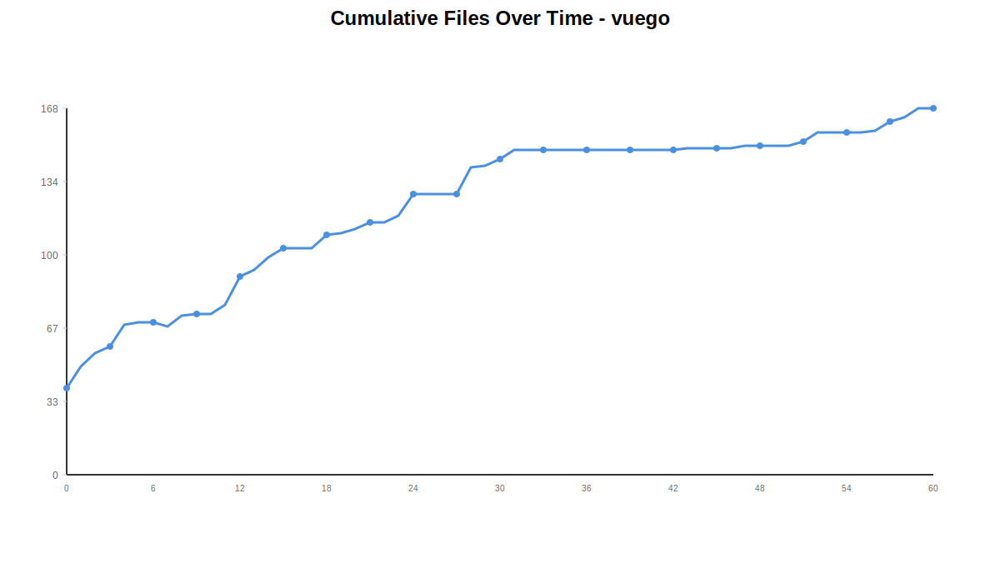
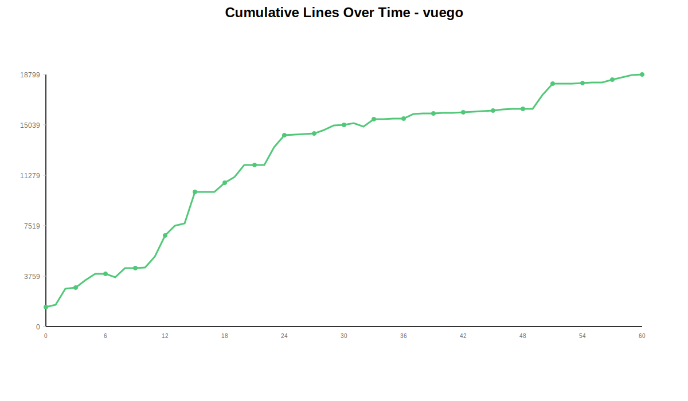
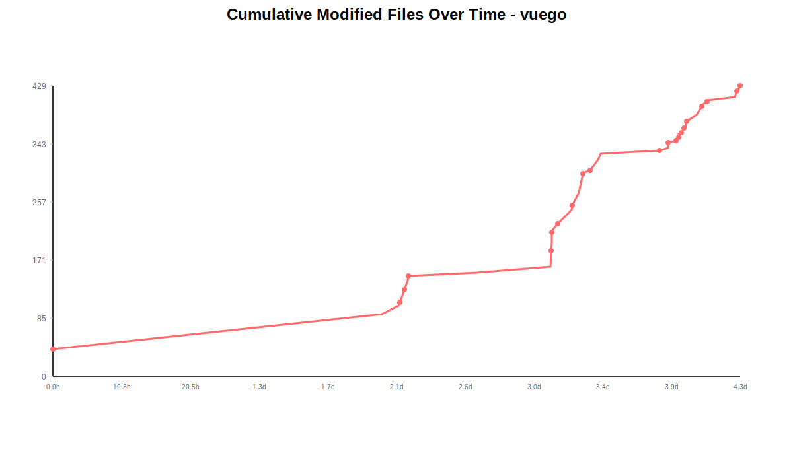
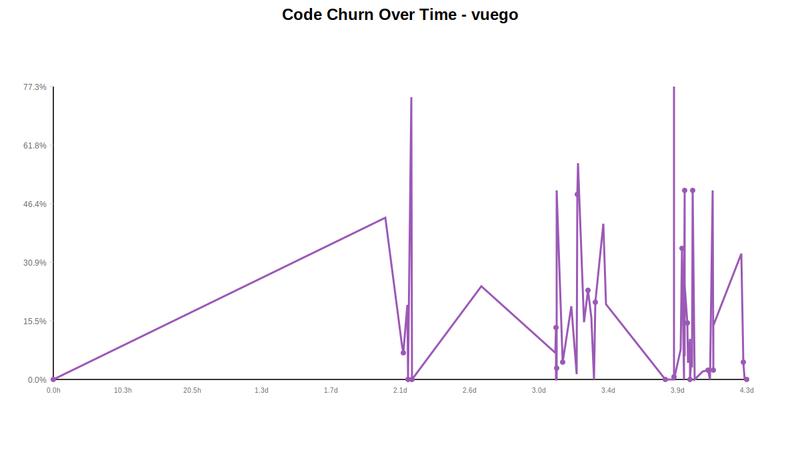
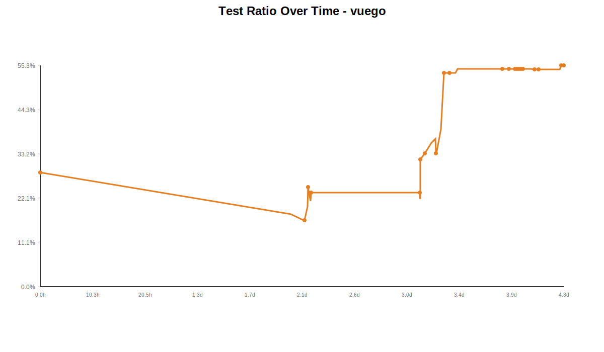

# Git Repository Analysis: vuego

This document contains statistics and analysis for the **vuego** repository.

## Overall Statistics

**Total Commits:** 61

## Visualizations

### Cumulative Files Over Time

[View full chart](chart-cumulative-files.svg)

### Cumulative Lines Over Time

[View full chart](chart-cumulative-lines.svg)

### Cumulative Modified Files Over Time

[View full chart](chart-modified-files.svg)

### Code Churn Over Time

[View full chart](chart-code-churn.svg)

### Test Ratio Over Time

[View full chart](chart-test-ratio.svg)

## Hourly Activity (24-Hour Histogram)

| Hour | Commits | Bar |
|------|---------|-----|
| 00:00 | 6 | █████████████████████████████████ |
| 01:00 | 2 | ███████████ |
| 02:00 | 2 | ███████████ |
| 03:00 | 1 | █████ |
| 04:00 | 1 | █████ |
| 05:00 | 0 |  |
| 06:00 | 0 |  |
| 07:00 | 0 |  |
| 08:00 | 0 |  |
| 09:00 | 1 | █████ |
| 10:00 | 0 |  |
| 11:00 | 0 |  |
| 12:00 | 1 | █████ |
| 13:00 | 0 |  |
| 14:00 | 4 | ██████████████████████ |
| 15:00 | 7 | ██████████████████████████████████████ |
| 16:00 | 7 | ██████████████████████████████████████ |
| 17:00 | 1 | █████ |
| 18:00 | 2 | ███████████ |
| 19:00 | 4 | ██████████████████████ |
| 20:00 | 9 | ██████████████████████████████████████████████████ |
| 21:00 | 2 | ███████████ |
| 22:00 | 5 | ███████████████████████████ |
| 23:00 | 6 | █████████████████████████████████ |

## Daily Statistics

| Date | Commits | Files Added | Files Removed | Lines Added | Lines Removed |
|------|---------|-------------|---------------|-------------|---------------|
| 2025-11-11 | 1 | 40 | 0 | 1453 | 0 |
| 2025-11-13 | 9 | 39 | 5 | 4223 | 1279 |
| 2025-11-14 | 13 | 42 | 0 | 8451 | 770 |
| 2025-11-15 | 33 | 42 | 1 | 8080 | 1941 |
| 2025-11-16 | 5 | 11 | 0 | 603 | 21 |

## Test Ratio Over Time

| Date | Test Files | Source Files | Total Go Files | Test Ratio |
|------|------------|--------------|----------------|------------|
| 2025-11-11 | 2 | 5 | 7 | 28.6% |
| 2025-11-13 | 4 | 13 | 17 | 23.5% |
| 2025-11-14 | 10 | 20 | 30 | 33.3% |
| 2025-11-15 | 25 | 21 | 46 | 54.3% |
| 2025-11-16 | 26 | 21 | 47 | 55.3% |

## Commit-by-Commit Analysis

This section provides detailed metrics for each commit.

| Commit | Date | Time | Files Added | Files Removed | Files Changed | Lines Added | Lines Removed | Total Files | Test Files | Source Files | Test Ratio | Code Churn |
|--------|------|------|-------------|---------------|---------------|-------------|---------------|-------------|------------|--------------|------------|------------|
| 4e19185c | 2025-11-11 | 18:11:57 | 40 | 0 | 40 | 1453 | 0 | 40 | 2 | 5 | 28.6% | 0.0% |
| 6a9b7eab | 2025-11-13 | 19:26:47 | 13 | 3 | 52 | 743 | 556 | 50 | 2 | 9 | 18.2% | 42.8% |
| 6250d75a | 2025-11-13 | 21:55:00 | 6 | 0 | 13 | 1313 | 131 | 56 | 2 | 10 | 16.7% | 9.1% |
| 3f80809e | 2025-11-13 | 22:08:04 | 3 | 0 | 5 | 92 | 7 | 59 | 2 | 10 | 16.7% | 7.1% |
| 4580d587 | 2025-11-13 | 22:42:27 | 10 | 0 | 15 | 743 | 182 | 69 | 3 | 12 | 20.0% | 19.7% |
| 238bae65 | 2025-11-13 | 22:45:27 | 1 | 0 | 2 | 482 | 8 | 70 | 4 | 12 | 25.0% | 1.6% |
| 7334747a | 2025-11-13 | 22:48:02 | 0 | 0 | 1 | 3 | 0 | 70 | 4 | 12 | 25.0% | 0.0% |
| 9a5b411a | 2025-11-13 | 23:17:44 | 0 | 2 | 14 | 135 | 394 | 68 | 3 | 11 | 21.4% | 74.5% |
| 944a27da | 2025-11-13 | 23:21:17 | 5 | 0 | 6 | 690 | 1 | 73 | 4 | 13 | 23.5% | 0.1% |
| 995353f2 | 2025-11-13 | 23:23:40 | 1 | 0 | 1 | 22 | 0 | 74 | 4 | 13 | 23.5% | 0.0% |
| 559daeff | 2025-11-14 | 09:40:31 | 0 | 0 | 5 | 49 | 16 | 74 | 4 | 13 | 23.5% | 24.6% |
| 0ecd103a | 2025-11-14 | 20:38:43 | 4 | 0 | 8 | 863 | 66 | 78 | 4 | 13 | 23.5% | 7.1% |
| 7d6db4fb | 2025-11-14 | 20:41:21 | 13 | 0 | 24 | 1874 | 299 | 91 | 4 | 13 | 23.5% | 13.8% |
| 07f135b7 | 2025-11-14 | 20:42:45 | 3 | 0 | 3 | 718 | 0 | 94 | 4 | 14 | 22.2% | 0.0% |
| 5ccd00d8 | 2025-11-14 | 20:47:20 | 6 | 0 | 6 | 208 | 0 | 100 | 4 | 14 | 22.2% | 0.0% |
| b1b46bbd | 2025-11-14 | 20:47:29 | 4 | 0 | 18 | 2419 | 75 | 104 | 7 | 15 | 31.8% | 3.0% |
| 0fae4ce2 | 2025-11-14 | 20:49:26 | 0 | 0 | 1 | 1 | 0 | 104 | 7 | 15 | 31.8% | 0.0% |
| 4c8effa0 | 2025-11-14 | 20:50:00 | 0 | 0 | 1 | 1 | 1 | 104 | 7 | 15 | 31.8% | 50.0% |
| 8e40e997 | 2025-11-14 | 21:40:09 | 6 | 0 | 11 | 685 | 33 | 110 | 8 | 16 | 33.3% | 4.6% |
| d217438f | 2025-11-14 | 22:58:08 | 1 | 0 | 12 | 576 | 138 | 111 | 9 | 16 | 36.0% | 19.3% |
| d49b5a60 | 2025-11-14 | 23:45:20 | 2 | 0 | 8 | 927 | 14 | 113 | 10 | 17 | 37.0% | 1.5% |
| 071d2ec9 | 2025-11-14 | 23:53:44 | 3 | 0 | 7 | 121 | 116 | 116 | 10 | 20 | 33.3% | 48.9% |
| 22d01ff9 | 2025-11-14 | 23:55:32 | 0 | 0 | 2 | 9 | 12 | 116 | 10 | 20 | 33.3% | 57.1% |
| c5bfb2ce | 2025-11-15 | 00:51:12 | 3 | 0 | 17 | 1583 | 284 | 119 | 13 | 20 | 39.4% | 15.2% |
| ea7b1d54 | 2025-11-15 | 01:27:39 | 10 | 0 | 28 | 1323 | 410 | 129 | 23 | 20 | 53.5% | 23.7% |
| 9e72f805 | 2025-11-15 | 01:56:58 | 0 | 0 | 3 | 81 | 16 | 129 | 23 | 20 | 53.5% | 16.5% |
| 8490bc92 | 2025-11-15 | 02:20:02 | 0 | 0 | 1 | 3 | 0 | 129 | 23 | 20 | 53.5% | 0.0% |
| 95a8ca0a | 2025-11-15 | 02:29:26 | 0 | 0 | 1 | 82 | 21 | 129 | 23 | 20 | 53.5% | 20.4% |
| 0935c8da | 2025-11-15 | 03:45:43 | 13 | 1 | 15 | 895 | 629 | 141 | 23 | 20 | 53.5% | 41.3% |
| 140b65f6 | 2025-11-15 | 04:05:34 | 1 | 0 | 9 | 450 | 112 | 142 | 24 | 20 | 54.5% | 19.9% |
| 35fd9bd6 | 2025-11-15 | 12:52:58 | 3 | 0 | 5 | 40 | 0 | 145 | 24 | 20 | 54.5% | 0.0% |
| 5780cc9e | 2025-11-15 | 14:10:23 | 4 | 0 | 4 | 124 | 0 | 149 | 24 | 20 | 54.5% | 0.0% |
| d51fa830 | 2025-11-15 | 14:12:33 | 0 | 0 | 4 | 102 | 347 | 149 | 24 | 20 | 54.5% | 77.3% |
| a4d0fc68 | 2025-11-15 | 14:12:51 | 0 | 0 | 4 | 571 | 5 | 149 | 24 | 20 | 54.5% | 0.9% |
| c8f12481 | 2025-11-15 | 14:13:20 | 0 | 0 | 1 | 1 | 0 | 149 | 24 | 20 | 54.5% | 0.0% |
| 21899fc8 | 2025-11-15 | 15:07:21 | 0 | 0 | 1 | 23 | 2 | 149 | 24 | 20 | 54.5% | 8.0% |
| c736b4d8 | 2025-11-15 | 15:21:20 | 0 | 0 | 1 | 17 | 9 | 149 | 24 | 20 | 54.5% | 34.6% |
| f05a82e3 | 2025-11-15 | 15:40:32 | 0 | 0 | 2 | 335 | 0 | 149 | 24 | 20 | 54.5% | 0.0% |
| 96b2fc1c | 2025-11-15 | 15:41:00 | 0 | 0 | 1 | 46 | 8 | 149 | 24 | 20 | 54.5% | 14.8% |
| 3d69103b | 2025-11-15 | 15:44:51 | 0 | 0 | 1 | 1 | 1 | 149 | 24 | 20 | 54.5% | 50.0% |
| f681d156 | 2025-11-15 | 15:45:01 | 0 | 0 | 3 | 60 | 4 | 149 | 24 | 20 | 54.5% | 6.2% |
| be3ca5da | 2025-11-15 | 15:45:25 | 0 | 0 | 2 | 18 | 6 | 149 | 24 | 20 | 54.5% | 25.0% |
| 4e512635 | 2025-11-15 | 16:09:04 | 0 | 0 | 2 | 51 | 9 | 149 | 24 | 20 | 54.5% | 15.0% |
| 13f5fb82 | 2025-11-15 | 16:15:34 | 1 | 0 | 2 | 43 | 2 | 150 | 24 | 20 | 54.5% | 4.4% |
| 1ba17375 | 2025-11-15 | 16:32:37 | 0 | 0 | 3 | 50 | 6 | 150 | 24 | 20 | 54.5% | 10.7% |
| 81b225f1 | 2025-11-15 | 16:32:49 | 0 | 0 | 2 | 20 | 0 | 150 | 24 | 20 | 54.5% | 0.0% |
| a2594bac | 2025-11-15 | 16:51:13 | 0 | 0 | 2 | 94 | 9 | 150 | 24 | 20 | 54.5% | 8.7% |
| 966f4384 | 2025-11-15 | 16:53:13 | 1 | 0 | 4 | 59 | 2 | 151 | 24 | 20 | 54.5% | 3.3% |
| 85887d86 | 2025-11-15 | 16:57:25 | 0 | 0 | 4 | 3 | 3 | 151 | 24 | 20 | 54.5% | 50.0% |
| acba4df5 | 2025-11-15 | 17:17:11 | 0 | 0 | 2 | 0 | 0 | 151 | 24 | 20 | 54.5% | 0.0% |
| 99f20878 | 2025-11-15 | 18:25:46 | 0 | 0 | 8 | 1022 | 23 | 151 | 24 | 20 | 54.5% | 2.2% |
| 1b39d464 | 2025-11-15 | 19:10:05 | 2 | 0 | 12 | 896 | 24 | 153 | 25 | 21 | 54.3% | 2.6% |
| a2e99a6f | 2025-11-15 | 19:28:28 | 4 | 0 | 4 | 6 | 0 | 157 | 25 | 21 | 54.3% | 0.0% |
| c5723724 | 2025-11-15 | 19:57:07 | 0 | 0 | 1 | 1 | 1 | 157 | 25 | 21 | 54.3% | 50.0% |
| d230f5ac | 2025-11-15 | 20:00:11 | 0 | 0 | 2 | 38 | 1 | 157 | 25 | 21 | 54.3% | 2.6% |
| e40bfff2 | 2025-11-15 | 20:01:00 | 0 | 0 | 2 | 42 | 7 | 157 | 25 | 21 | 54.3% | 14.3% |
| f095c45f | 2025-11-16 | 00:08:29 | 1 | 0 | 5 | 20 | 10 | 158 | 25 | 21 | 54.3% | 33.3% |
| b003b16e | 2025-11-16 | 00:27:52 | 4 | 0 | 9 | 222 | 11 | 162 | 26 | 21 | 55.3% | 4.7% |
| 4dd719e3 | 2025-11-16 | 00:40:50 | 2 | 0 | 2 | 183 | 0 | 164 | 26 | 21 | 55.3% | 0.0% |
| 0001d6e2 | 2025-11-16 | 00:50:31 | 4 | 0 | 4 | 174 | 0 | 168 | 26 | 21 | 55.3% | 0.0% |
| 01ae36d8 | 2025-11-16 | 00:53:41 | 0 | 0 | 1 | 4 | 0 | 168 | 26 | 21 | 55.3% | 0.0% |

